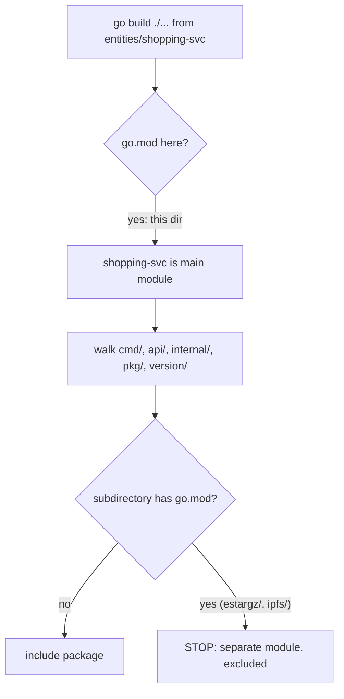

# Module discovery

## How `go` finds modules in a directory tree

Go module discovery is driven entirely by the presence of `go.mod` files —
not by directory naming conventions. Starting from the current working
directory (or the target import path), the `go` command walks **up** the
tree looking for the nearest `go.mod` to determine "what module am I in,"
and walks **down** the tree when expanding a `...` pattern such as
`go build ./...`, but it **stops descending the instant it finds another
`go.mod`**.

```
monorepo/                                  (no go.mod here — not a module)
└── entities/
    ├── shared-lib/
    │   └── go.mod                         module A: shared-lib
    └── shopping-svc/
        ├── go.mod                         module B: shopping-svc
        ├── cmd/ api/ internal/ pkg/ version/   <- owned by module B
        ├── estargz/
        │   └── go.mod                     module C: estargz (independent!)
        └── ipfs/
            └── go.mod                     module D: ipfs (independent!)
```

Running `go build ./...` from inside `entities/shopping-svc` walks
`cmd/`, `api/`, `internal/`, `pkg/`, `version/` — and then, on reaching
`entities/shopping-svc/estargz/go.mod`, **stops**. `estargz` and `ipfs` are
not part of module B's package set; they are their own modules that happen
to live in nested directories. This is verified live in
[`experiments.md`](./experiments.md#7-nested-modules-stop-parent-traversal).

Because there is no `go.mod` at the repository root (`monorepo/`), the
repository itself is not a Go module — it is a plain container ("monorepo")
holding four independent modules. This is what "multi-module monorepo"
means in Go: a single Git repository, but N separate module graphs.

## Module discovery vs. package discovery

Two distinct mechanisms are at play:

1. **Module boundary discovery** (build-time, per invocation): walking
   directories to find `go.mod` files, as above. This determines which
   packages belong to "the main module" for a given `go` command.
2. **Module *version* discovery** (dependency resolution): when a `go.mod`
   `require`s a module path it does *not* have locally, `go` fetches it —
   via the module proxy (`GOPROXY`) or directly from the VCS root — using
   the version resolution and tag-mapping rules described in
   [`version-resolution.md`](./version-resolution.md) and
   [`tag-naming.md`](./tag-naming.md).

## Local multi-module development: `go.work`

Because `estargz`, `ipfs`, `shopping-svc`, and `shared-lib` are four
independent modules, a normal `go build` from any one of them can't see
uncommitted edits made in the others — it would need to `go get` a
published version, exactly like an external consumer. `go.work` (Go
workspaces, this repo's [`go.work`](../go.work)) solves purely the *local
development* half of this problem: it tells the `go` command "treat these
local directories as the source of truth for these module paths,"
overriding normal version resolution without editing any `go.mod`.

`go.work` is invisible to consumers — it only affects commands run from
inside this repository — which is why the *consumer* repository instead
uses `replace` directives (see
[`experiments.md`](./experiments.md#6-local-development-with-replace)) to
achieve the same "build against my local checkout" effect from outside the
monorepo.

## Diagram: discovery walk


