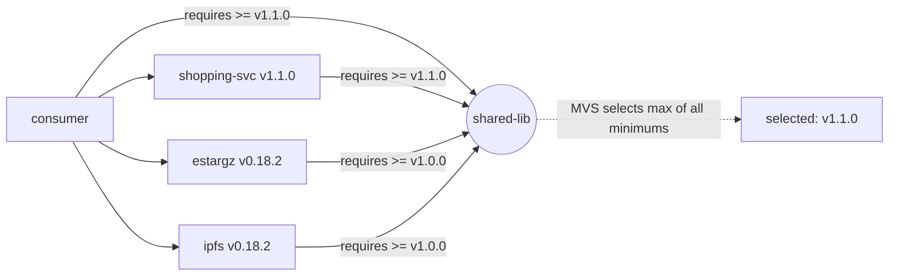

# Version selection, pseudo-versions, and `replace`

## Minimal Version Selection (MVS)

Go does not pick "the newest version available" — it picks the **minimum
version that satisfies every requirement in the build list**. Every module
in the dependency graph states the minimum version of each of its own
dependencies that it needs; the final build uses, for each dependency, the
maximum of all the minimums requested — i.e. the lowest version that is
still high enough for everyone.

In this repo:

- `entities/shopping-svc` (v1.1.0) requires `shared-lib >= v1.1.0`
- `entities/shopping-svc/estargz` (v0.18.2) requires `shared-lib >= v1.0.0`
- `entities/shopping-svc/ipfs` (v0.18.2) requires `shared-lib >= v1.0.0`

The consumer imports all three, so MVS takes `max(v1.1.0, v1.0.0, v1.0.0) =
v1.1.0`. This is exactly what `go mod graph` and `go list -m all` show —
see [experiment 1](./experiments.md#1-correct-dependency-resolution).



MVS is deliberately conservative and deterministic: adding a new importer
that needs a higher minimum can only ever raise the selected version, never
lower it, and builds are 100% reproducible from `go.mod` + `go.sum` without
ever contacting a resolver that could return a different answer on a
different day (unlike, say, npm's newest-satisfying-range default).

## Pseudo-versions

A pseudo-version is what `go get` synthesizes when you request a commit
that has **no** semver tag pointing at it. Its shape:

```
vX.Y.(Z+1)-0.YYYYMMDDHHMMSS-abcdefabcdef
 │           │                └─ first 12 hex chars of the commit hash
 │           └─ commit's UTC timestamp
 └─ next patch after the highest existing tag reachable from that commit
```

Real, captured output from this repo — `shared-lib`'s tip commit adds a
`Reverse()` helper *after* the `v1.1.0` tag, but was never itself tagged:

```
$ go get github.com/abhi4u1947/go-multimodule-poc/entities/shared-lib@<branch>
go: downloading .../shared-lib v1.1.1-0.20260703101852-89455342706c
go: upgraded .../shared-lib v1.1.0 => v1.1.1-0.20260703101852-89455342706c
```

`v1.1.1` (not `v1.1.0`) because the pseudo-version must sort *after* the
last real tag it descends from — `go` bumps the patch component so that
"has this exact untagged commit" always outranks "has the last tagged
release" in version comparisons. See
[experiment 5](./experiments.md#5-missing-tags--pseudo-versions) for the
full transcript.

## `replace`: local development, then removal

`replace` directives are a **build-time override local to the module
issuing them** — they never propagate to consumers of that module, and
they are the standard way to point a `require`d module path at a local
filesystem checkout while iterating on both sides of an API change at
once:

```
replace github.com/abhi4u1947/go-multimodule-poc/entities/shared-lib => ../local-dev-shared-lib
```

While present, every build of the replacing module (and anything that
imports it) uses the code on disk at that path — unpublished, untagged,
whatever's there — completely bypassing version resolution for that one
module path. Removing the line snaps resolution straight back to whatever
the `require` directive + `go.sum` say, i.e. back to the real, Git-tagged
version. Both states are captured verbatim in
[experiment 6](./experiments.md#6-local-development-with-replace).

## Module path mismatch

`go.mod`'s `module` line is the *only* source of truth for a module's
identity. If a module is fetched at import path `P` but its own `go.mod`
declares a different path `Q`, `go` refuses to proceed:

```
module declares its path as: Q
        but was required as: P
```

This is a deliberate integrity check: without it, a compromised or
misconfigured module could silently masquerade as a different, trusted
import path. See [experiment 3](./experiments.md#3-module-path-mismatch)
for the real error text produced by this repo's intentionally-broken
`estargz-wrong-path` example.
